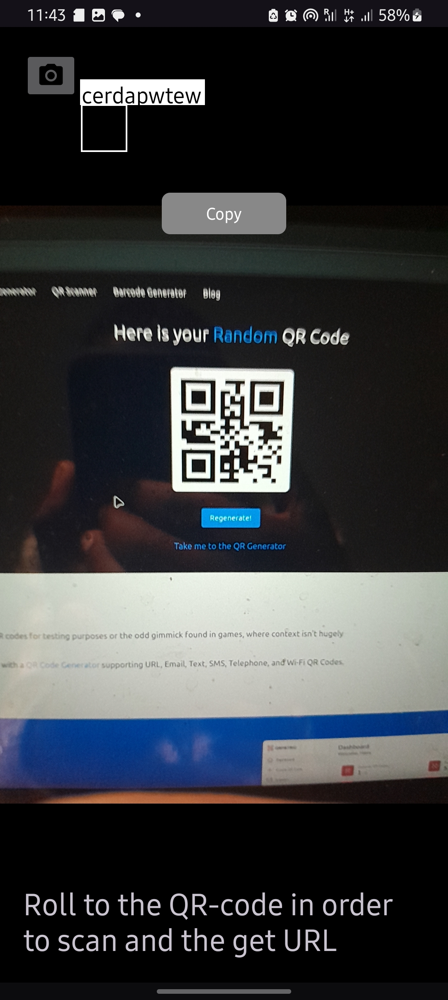
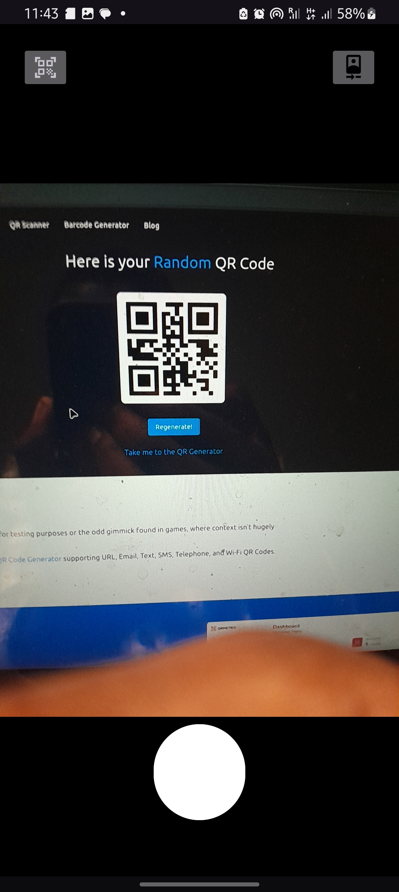

# QR Code Scanner for Android

A QR code scanner for Android, made using Google ML Kit and CameraX. In addition to scanning QR codes, the app also allows you to capture photos.

## How to Run

1. Download the latest version of Android Studio.
2. Clone this repository.
3. Open the project in Android Studio and run it on your device or emulator.

## Screenshots

## License

This project is licensed under the MIT License. See the [LICENSE](LICENSE) file for details.
